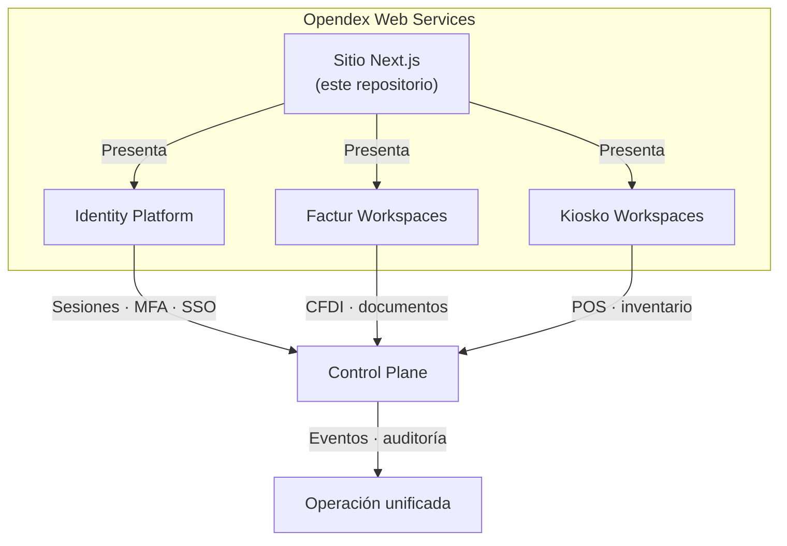

# Opendex Web Services, Inc

Sitio corporativo y de producto de **Opendex Web Services (OWS)**. Plataforma **solo frontend** orientada a presentar una suite B2B de infraestructura digital para SaaS en México y LATAM: identidad, facturación fiscal y operación comercial.

Inspirado en los estándares visuales y de producto de referentes como Auth0, Linear, Stripe y Vercel.

---

## ¿De qué trata?

Opendex unifica tres dominios bajo una misma consola operativa, con trazabilidad, permisos y eventos compartidos:

| Producto | Dominio | Descripción |
|----------|---------|-------------|
| **Opendex Identity Platform** | Identidad | Sesiones, passkeys, SSO, MFA, auditoría y decisiones de riesgo |
| **Factur Workspaces** | Fiscal | Documentos CFDI, validaciones, estados y control documental |
| **Opendex Kiosko Workspaces** | Retail | Caja, sucursales, inventario y cortes operativos |

Además, OWS ofrece **creación de páginas web** para empresas que necesitan presencia digital profesional.

> **Nota:** Este repositorio es la capa de marketing y presentación. No incluye backend ni APIs reales; los endpoints y SDKs mostrados en el sitio son borradores de producto.

---

## Arquitectura conceptual



---

## Stack tecnológico

| Capa | Tecnología |
|------|------------|
| Framework | Next.js 16 (App Router) |
| UI | React 19, TypeScript |
| Estilos | Tailwind CSS 4 |
| Animación | Framer Motion, GSAP |
| 3D | Three.js, React Three Fiber, Drei |
| i18n | Español, inglés, portugués, francés, chino |

---

## Estructura del proyecto

```
src/
├── app/                  # Rutas y páginas (App Router)
│   ├── page.tsx          # Landing principal
│   ├── productos/        # Auth, Invoice, Kiosko
│   ├── soluciones/       # SaaS, Fintech, Retail
│   ├── documentacion/
│   ├── precios/, faq/, blog/, contacto/, ...
│   └── layout.tsx
├── components/           # UI, Hero, Navbar, Footer, etc.
│   └── three/            # Escenas 3D (ecosistema, flujos de producto)
├── i18n/                 # Diccionarios y proveedor de idioma
└── styles/
    └── globals.css       # Estilos globales y tokens de diseño

docs/ux/                  # Documentación de rediseño (JTBD, flujos)
skills/opendex-elite-ui/  # Guía de diseño UI/UX del producto
public/                   # Assets estáticos (logo, imágenes, favicon)
```

### Páginas principales

| Ruta | Contenido |
|------|-----------|
| `/` | Landing: hero, portafolio, arquitectura, developer platform |
| `/productos/auth` | Opendex Identity Platform |
| `/productos/invoice` | Factur Workspaces |
| `/productos/kiosko` | Opendex Kiosko Workspaces |
| `/documentacion` | Documentación técnica |
| `/precios` | Planes y precios |
| `/contacto` | Formulario de contacto / cotización |

---

## Instalación

Requisitos: **Node.js 20+** o **Bun**.

```bash
# Con npm
npm install
npm run dev

# Con bun
bun install
bun run dev
```

Abre [http://localhost:3000](http://localhost:3000) en el navegador.

### Scripts disponibles

| Comando | Descripción |
|---------|-------------|
| `npm run dev` | Servidor de desarrollo |
| `npm run build` | Build de producción |
| `npm run start` | Servidor de producción |
| `npm run lint` | ESLint |

---

## Paleta de colores

| Token | Hex | Uso |
|-------|-----|-----|
| Fondo principal | `#faf8f4` | Background general |
| Texto | `#1d1d1b` | Tipografía principal |
| Acento primario | `#f6821f` | Identity, CTAs |
| Acento secundario | `#ff500a` | Fiscal, alertas |
| Acento terciario | `#ff9910` | Retail, highlights |

Los estilos globales viven en `src/styles/globals.css`.

---

## Internacionalización

El sitio soporta 5 idiomas configurados en `src/i18n/config.ts`:

- Español (por defecto)
- English
- Português
- Français
- 中文

Los componentes `LocalizedLabel` y `LocalizedPageHeader` consumen los diccionarios en `src/i18n/dictionaries.ts`.

---

## Personalización

- **Componentes:** edita o extiende archivos en `src/components/`.
- **Páginas:** agrega rutas bajo `src/app/`.
- **Traducciones:** actualiza `src/i18n/dictionaries.ts` y `commonLabels.ts`.
- **Diseño UI:** consulta `skills/opendex-elite-ui/SKILL.md` para el estándar visual.

---

## Licencia

Proyecto privado. © 2026 Opendex Web Services, Inc.
